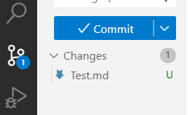

# Github basics

## Setting up GIT in VS Code

Once you create a **[Github Account](https://github.com/)**, you can connect VS Code directly to your remote account.

[This article gives more detail on how to get started setting up GIT for VS Code](https://git-scm.com/book/en/v2/Getting-Started-First-Time-Git-Setup)

## First Time Git Setup

To set your account's default identity, open the terminal and run

```CLI
  git config --global user.email "you@example.com"
  git config --global user.name "Your Name"
```

You can omit the `--global` flag to set the identity only in the specific repository that is open, otherwise include it to access all your repositories.

`you@exmple.com` is the email you used to create your GitHub account, and "Your Name" is the user name associated with your GitHub account. Your user name precedes your repositories, and is part of your profile's URL, e.g., `https://github.com/username`.

To find your GitHub username you can also go to your GitHub profile page in your account, which is accessed by clicking the icon found at the top right of the page:


## How to Initiate a GitHub Repository from VS Code using the Source Control Icon

You can create a GitHub repository directly on your local installation of Visual Studio Code and upload it to your GiHub account:

1. **Create your project folder locally** and add your files³.
2. **Open your project folder with VS Code**¹.
3. **Initialize a new local Git repository**:
    - When you're ready to upload your repository and its contents as a new repository in your GitHub account, click on the 'Source Control' icon on the left navbar in VS Code. It's third from the top, below the search icon and has three little circles connected by two lines¹².

   

    - Clicking the Source Control icon brings up the `Initialize Repository` button, which creates a new Git Repository inside the current local folder, allowing you to start tracking changes².

    - Clicking the `Source Control` icon shows the blue  `Commit` button above the uncommited changes in your file:

    


4. **Commit your changes**:
    - You should be able to see files ready to be committed. They have a `U` on the right of their names, for "Uncommitted".
    - Press on the `Commit` button, answer "yes" to the pop-up dialogue, provide comments to stage your changes and commit the files by clicking the checkmark in the area at the top right. The checkmark, when hovered over, shows the label `Accept Commit Message`¹.
  
    

    - In the pop-up dialogue that appears, click `Save` to upload your files, then click the blue `Publish Branch` button that follows.

    - Click `Allow` to have VS Code log into your GitHub account using the log-in credentials you already configured.

    - Lastly, choose whether you want the repository to be Private (only you can see it) or Public (anyone can see it) and click.

    - Now if you go to your GitHub account you will see the uploaded repository and all its files³.

Note that you need to have **Git** installed on your computer to perform these actions². If Git is missing, then the `Source Control` icon will show instructions on how to install GIT². Make sure to restart VS Code after GIT is installed².

**References**

(1) How to Create a Github Repository from VS Code (Example). https://www.jcchouinard.com/create-a-github-repository-vscode/.

(2) Introduction to Git in VS Code - Visual Studio Code. https://code.visualstudio.com/docs/sourcecontrol/intro-to-git.

(3) How to add a new project to Github using VS Code. https://stackoverflow.com/questions/46877667/how-to-add-a-new-project-to-github-using-vs-code.

## Initializing a new repository from the VS Code Terminal

**Open the VS Code Terminal:** Use the shortcut `Ctrl+'` (backtick) to open the terminal or open it directly from the VS Code nav bar at the top of the window.

**Navigate to the Project Directory:** Use the `cd` command to "change directory" and navigate to your project's folder. For example, `cd path/to/your/project`.

**Initialize the Repository:** Run the command `git init` to initializes a new Git repository in your project directory by creating a .git folder.

**Add Files to the Repository:** Once you're ready to upload files, hyou first need to stage them using `git add`. To add all files, you can use `git add --all`.

**Commit the Files:** Commit the staged files to the repository with `git commit -m "Your commit message"`, where "Your commit message" is a breif description of your modifications.

Here's how the commands would look in the terminal:

```
cd path/to/your/project
git init
git add --all
git commit -m "Commit message"
```

After these steps, your new repository is initialized and ready to push your code to a remote repository in GitHub. 

In the terminal, use the command `git push`to upload your files.

## Using the VS Code Terminal to clone and edit a GitHub Repository

- If the repository already exists in your GitHub account, you can clone (copy) the repository to your local computer using the command line (the terminal).
- For that you will need the URL of the repository in your Github account, so open your GitHub account and go to your repository.  
- The repository window shows a list of the files and folders, and there is a green "Code" button to the right. Clicking on that button reveals a list of options to copy or clone the files to your computer. Note that the URL for the repository is found here as well.


### Clone your repository to your local machine

- To clone your repository from GitHub to your local computer, go to your repository page on GitHub and click the green "Code" button. You can Clone a copy using the web URL being displayed in the “HTTPs” tab. 

- Copy this URL and then use the terminal to sync any changes you make on the files of the cloned repository, to the original repository.

- On your local machine, open terminal and `cd` (change directory) to where you would like to clone your repository.

- Once you are in the directory, type in the terminal:

- `git clone https://github.com/YOUR-URL-TO-REPO-HERE`

- When you run `git clone repo-path-here`, You should see output like this:

```
cloning into 'test-repo'...
remote: Counting objects: 5, done.
remote: Compressing objects: 100% (4/4), done.
remote: Total 5 (delta 0), reused 0 (delta 0), pack-reused 0
Unpacking objects: 100% (5/5), done.
Checking connectivity... done.
```

### Edit your file and upload to repository

- NOTE that the `.git` element is also downloaded and shows up in the copied directory. It is needed to keep track of changes (the commits that you make) to your file.
- Do not edit the `.git` element.

- After editing your file(s), save the changes, then in the terminal, type `git status` and hit return to execute the command. You should see:

```
On branch master
Your branch is up-to-date with 'origin/master'.
Changes not staged for commit:
  (use "git add <file>..." to update what will be committed)
  (use "git checkout -- <file>..." to discard changes in working directory)

	modified:   NAME-OF-MODIFIED-FILE

no changes added to commit (use "git add" and/or "git commit -a")
```

### Add and Commit

- Use the `add` and `commit` functions to add and commit changes that you made to your files, and upload them to your repositiory from your local directory.

- `git add` --> takes a modified file in your working directory and places the modified version in a staging area.

- `git commit` --> takes everything from the staging area and makes a permanent snapshot of the current state of your repository that is associated with a unique identifier.

### Add files

- You can add an individual file or groups of files to git tracking. To add a single file, use:

```
git add file-name-here-with-extension
```

- To add ALL of the files that you have edited at the same time, you can use:

```
git add --all
```

### Commit files

- Once you are ready to make a snapshot of the current state of your repository, you can use `git commit`. It requires a commit message that describes the snapshot / changes that you made in that commit.

- A commit message should outline what changed and why. These messages help others understand what was changed and why.

- If you are not committing a lot of changes, you can create a short one line commit message using the `-m` flag:

```
git commit -m "Editing the README to try out git add/commit"
```

### Push changes to GitHub

- To add the changes from the files on your computer to the version of your repository on GitHub, you need to push them GitHub with:

```
git push
```

- You will then be prompted for your GitHub user name and password. After you’ve pushed your commits, visit your repository on GitHub and notice that your changes are reflected there, and also that you have access to the full commit history.

### Remove Mac OS .DS_Store file from repositories

- This is from the following repositiory: [
vybstat/ds_store_removal](https://gist.github.com/vybstat/1680bef4715bfbcb0268)

```GIT

# How to remove the .DS_Store file from GitHub that MAC OS X creates

# First find and remove .DS_Store
find . -name .DS_Store -print0 | xargs -0 git rm -f --ignore-unmatch

# Create .gitignore file, if you need to
touch .gitignore
echo .DS_Store > .gitignore

# Push changes to GitHub
git add .gitignore
git commit -m '.DS_Store removed'
git push

```

### Reference:

- **[This article](https://dev.to/g_abud/advanced-git-reference-1o9j)** provides more complete instructions for using GitHub.


- **[This URL](https://www.earthdatascience.org/workshops/intro-version-control-git/basic-git-commands/)** gives step-by-step instructions for using the Command Line to clone your GithHub repository to your local computer.
